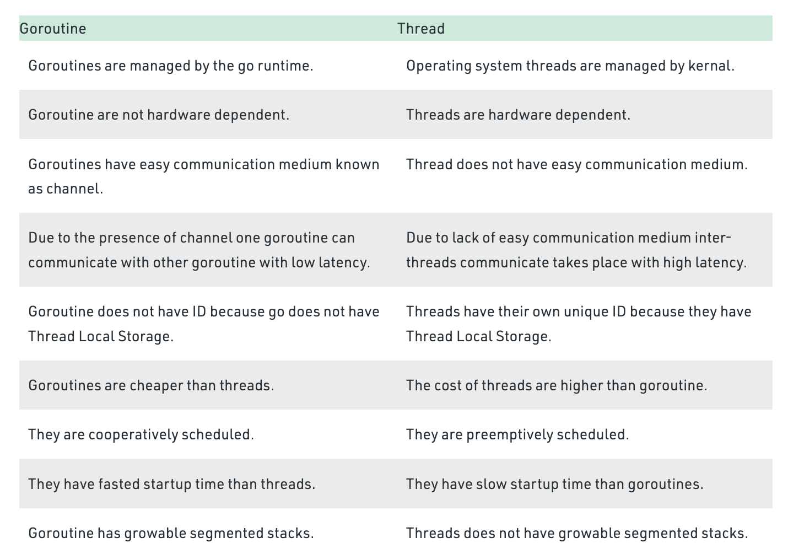

## Goroutine
Bu konu içerisinde golang ile goroutineleri çalıştırmayı göreceğiz

###Goroutine, Thread, Multihread Farkları 
- Goroutine: A Goroutine is a function or method which executes independently and simultaneously in connection with any other Goroutines present in your program. Or in other words, every concurrently executing activity in Go language is known as a Goroutines.
- Thread: A process is a part of an operating system which is responsible for executing an application. Every program that executes on your system is a process and to run the code inside the application a process uses a term known as a thread. A thread is a lightweight process, or in other words, a thread is a unit which executes the code under the program. So every program has logic and a thread is responsible for executing this logic.

Example:

 